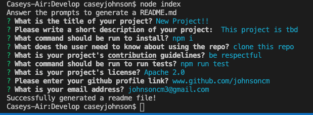
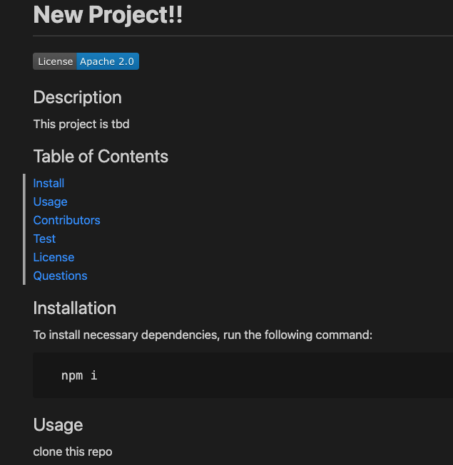
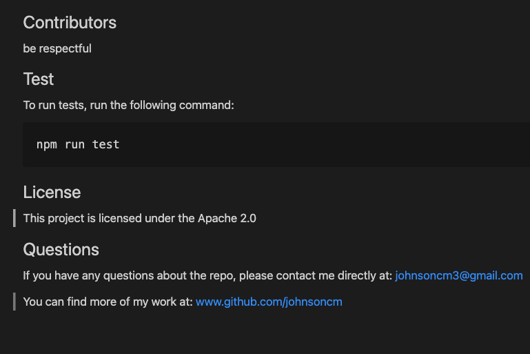

## README Generator

## Description

When creating an open source project on GiHub, it's important to have a high-quality README file for your application. This should include what the app is for, how to use the app, how to install it, how to report issues, and how to contribute.

The Readme Generator is a command-line application that dynamically generates a professional README file from a user's input using the [Inquirer package](https://www.npmjs.com/package/inquirer).

## Table of Contents

[Technologies Used](#Technologies-Used) 
[User Story](#User-Story) 
[Acceptance Criteria](#Acceptance-Criteria) 
[Images](#Images) 
[Demo](#Demo) 
[Contact](#Contact) 

## Technologies Used

     Javascript
     Node.js
     Inquirer

 ## User Story

    AS A developer
    I WANT a README generator
    SO THAT I can quickly create a professional README for a new project. This allows me to devote more time to working on the project.

## Acceptance Criteria

    GIVEN a command-line application that accepts user input
    WHEN I am prompted for information about my application repository
    THEN a high-quality, professional README.md is generated with the title of my project and sections entitled: Description, Table of Contents, Installation, Usage, License, Contributing, Tests, and Questions
    WHEN I enter my project title
    THEN this is displayed as the title of the README
    WHEN I enter a description, install instructions, usage information, contribution guidelines, and test instructions
    THEN this information is added to the corresponding sections of the README
    WHEN I choose a license for my application from a list of options
    THEN A badge for that license is added near the top of the README and a notice is added to the section of the README entitled License that explains which license the application is covered under
    WHEN I enter my contact information
    THEN this is added to the section of the README entitled Questions, with instructions on how to reach me with additional questions
    WHEN I click on the links in the Table of Contents
    THEN I am taken to the corresponding section fo the README

## Images

### Image of app:

****

### Sample README File Generated Using the app:

****
****

## Demo

**[Link to Walkthrough Video](https://drive.google.com/file/d/1hOaXRpNRwTBOGkbq6IBKXvyR2mGXaLla/view)**

## Contact

If you have any questions about this repo, please contact me at [johnsoncm](https://www.github.com/johnsoncm)

